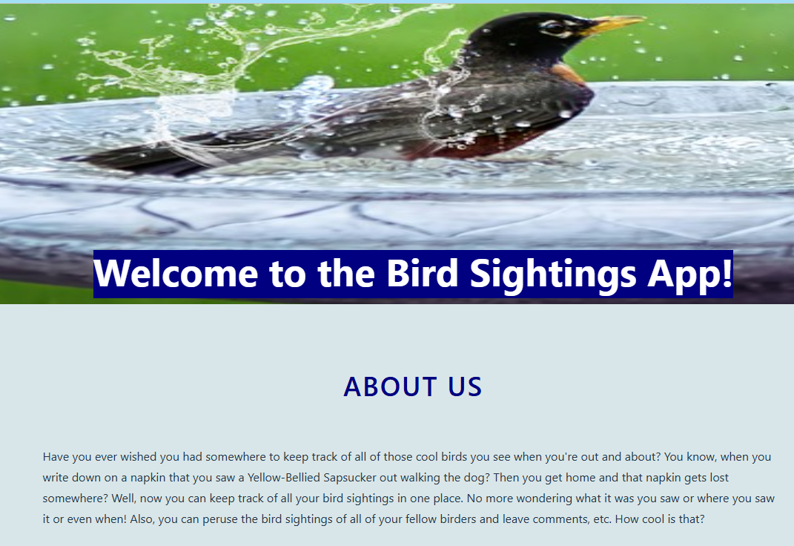

# BIRD SIGHTINGS

## Description of Project

The project was to build a API on a back-end server using Express and Node that is secured with JWTs.  The API will interact with MongoDB to utilize full CRUD.  The front-end was to be built with a React application using AJAX to communicate with the back-end. The app should manage and keep track of things of a personal interest to us. Once completed, we were to present our application to the class.  This was the third project we completed in this course.

## Brief

The type of application to build was entirely up to us and we were encouraged to choose something of personal interest to us.  The following minimum requirements were to be met:

* The back-end must be built with Express and Node.

* The front-end must be built with React.

* The database management system must be MongoDB.

* Both back and front-ends must utilize JWT token-based authentication.

* The app must have at least two data entities in addition to the User model and at least one entity must have a relationship with the User model.  

* The app must have full CRUD functionality on both back and front-end.

* Authorization must be implemented in the app.  Guests who are not signed in must not be able to create, update or delete data or access functionality allowing those actions.

* The front-end application can not hold any secret keys.  Those must be accessed from the back-end.

* The app must be deployed online.

## Timeframe & Working Team

We worked alone on this project.  We had one week to complete and present.

## Getting Started/Code Installation

The code for this project can be found in my public GitHub repository [here](https://github.com/chaoscgo/bird-sightings.git).

# How to use Bird Sightings

The Bird Sightings app is designed for people who love to watch birds.  It is a way to keep track of birds that you have seen and to reference a list of birds that your fellow birders have seen.

Anytime you see a cool bird, you'll have a place to note the name of the bird, the location where you saw the bird and the date that you saw it along with any notes you feel like making.  In addition, you can leave comments on the bird sightings of other users and they can leave comments on your birds.

You are able to manage your Bird Sightings by adding new birds, editing information about birds already in your list and deleting any birds you no longer wish to keep in your list.  

## Deployment Link

## Planning Materials

I started planning this project on Trello.  I created the User Stories first and then sketched out the ERD for my data entities.  We had the choice of using an embedded relationship or a referenced relationship.  I chose the embedded model.  I also sketched out wireframes of how I wanted certain pages to look.  My planning materials can be accessed [here](https://trello.com/b/AGp5kBwQ/bird-sightings).

I also created todos on Trello to keep me on track with this project.  Then I started coding!

## Build/Code Process

I started with the back-end and used the Express API JWT Auth Template starter code that we went over in class.  I installed the dependencies I needed and created a gitignore file to hold the dotenv, node-modules and package-lock.json files.  In the .env file, I stored my MongoDB connection string and my JWT secret key.

I built my user schema, my bird schema and the comment schema.  I embedded the comment schema into the bird schema.

I used Postman to test out sign-up functionality by creating a new collection called Birds.

I created a birdsRouter and mounted it to server.js.  I then defined all of my routes in the birdsRouter.  I defined routes for creating, indexing, showing, updating, deleting and creating comments. After I defined each route, I tested it in Postman.

I then moved on the creating the front-end in React. I used the React JWT Auth Template starter code that we used in class.  I installed dependencies and created a dotenv file to hold my Express backend secret key.  I stored this file and the node_modules and package-lock.json files in .gitignore.

I then built the BirdList component to list all of the birds entered by all users.  I created a birdService.js to group all the services related to the bird resources.  Afterwards, I built out components for showing bird details, creating new birds, editing and deleting birds, and creating comments.

I built a landing page to describe the app to anyone who landed on the page as well as a separate dashboard page for those users who signed in (using middleware to check for user status). I also built a loading page showing a picture of a hawk for pages that took a while to load.  

I tested the application after each step and once I was sure everything was working correctly, I styled the app with CSS.

## Challenges

My biggest challenge was formatting the date entered by the user, so that it appeared in a standard format.  Also, the date kept appearing as one day sooner than the date the user entered, so that was challenging to figure out.

I also had trouble getting the edit form's pre-populated data to clear out if the user changes their mind and clicks on 'New Bird' from the edit page. I will make that a future improvement.

I had more trouble with CSS on this project than earlier projects.  Especially using modules.css, I had to remember to create new classnames if there were elements I wanted to style differently on one page than another.  I finally decided to just use normal css files for the sign in and sign-up pages instead of the modules.

## Wins

As always, having an app that is fully functional and operates without errors is a win for me.

Getting the date formatting to be correct was a huge relief and required some researching to find the answer.  I ended up using date-fns and moment and the utc function.

I like having a different landing page and dashboard page depending on whether the user is signed in or not.

## Key Learnings/Takeaways

I learned that the more you do something, the more you learn.  Each time I work on a project, I feel that the concepts are making more sense to me. Testing (and commiting to Git) each step along the way is essential.

I still feel the need for more CSS training.  It's something I may pursue after this course is over.

## Attributions

All images (except the cartoon bird on the form page) were provided by [Pixabay](https://www.pixabay.com).
The cartoon bird on the form page was provided by  [Shutterstock](https://www.shutterstock.com)

## Technologies used:

HTML, CSS, Javascript, Markdown, Express, React, Node, MongoDB, JWT, AJAX, Postman, Trello, date-fns, moment.

## Future plans/improvements

* The ability to edit and delete comments by the author.
* Adding a link to an external API to provide bird images, descriptions, geography and bird calls.
* Clearing out the pre-populated data from the edit form if the user clicks on New Bird while on the edit page.
